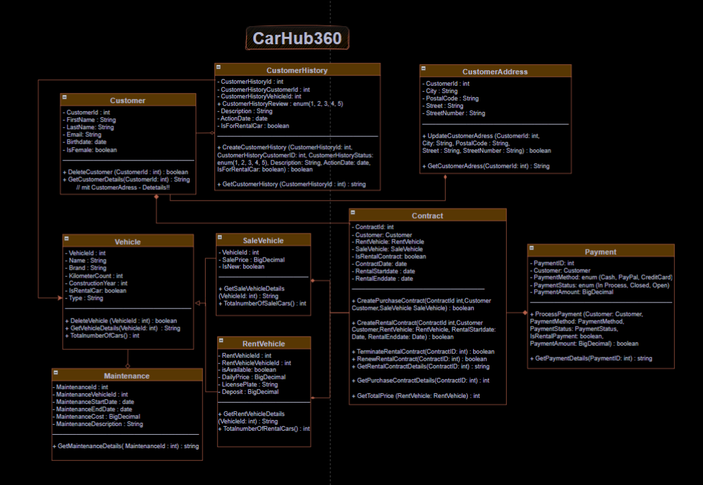
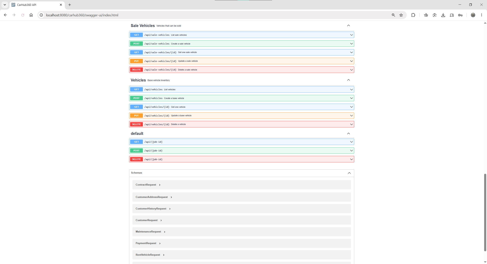

# CarHub360


**CarHub360** ist eine Jakarta-EE/WildFly-REST-Anwendung für Autohandel und Fahrzeugvermietung.

Das Projekt bildet zentrale Prozesse eines Autohauses ab: Kundenverwaltung, Adressen, Fahrzeugbestand, Verkaufsfahrzeuge, Mietfahrzeuge, Kauf- und Mietverträge, Zahlungen, Wartungen und Kundenhistorien. Der Schwerpunkt liegt auf einer nachvollziehbaren Backend-Architektur mit REST-API, JPA-Persistenz, fachlicher Validierung, OpenAPI-Dokumentation, Docker-Start und automatisierten Tests.

---

## Inhaltsverzeichnis

* [Projektziel](#projektziel)
* [Aktueller Status](#aktueller-status)
* [Screenshots](#screenshots)
* [Features](#features)
* [Tech-Stack](#tech-stack)
* [Schichten](#Schichten)
* [Datenmodell](#datenmodell)
* [Lokaler Start](#lokaler-start)
* [API-Dokumentation](#api-dokumentation)
* [API-Beispiele](#api-beispiele)
* [Wichtige Endpunkte](#wichtige-endpunkte)
* [Tests](#tests)
* [CI](#ci)
* [Projektstruktur](#projektstruktur)
* [Roadmap](#roadmap)
* [Autor](#autor)
* [License](#License)

---

## Projektziel

CarHub360 demonstriert den Aufbau einer strukturierten Java-Backend-Anwendung für ein realistisch abgegrenztes FH-Projekt. Die Anwendung stellt nicht nur einzelne CRUD-Endpunkte bereit, sondern macht fachliche Regeln sichtbar:

* Kunden können angelegt, aktualisiert, gelesen und per Soft Delete deaktiviert werden.
* Fahrzeuge werden als Basismodell, Verkaufsfahrzeuge und Mietfahrzeuge verwaltet.
* Kaufverträge und Mietverträge werden fachlich unterschiedlich validiert.
* Mietfahrzeuge werden beim Abschluss eines Mietvertrags automatisch als nicht verfügbar markiert.
* Zahlungen, Wartungen und Kundenhistorien sind eigenen fachlichen Bereichen zugeordnet.
* Die REST-API ist über Swagger UI testbar und über OpenAPI maschinenlesbar dokumentiert.

---

## Aktueller Status

| Bereich | Status |
| --- | --- |
| REST-API | Implementiert |
| Swagger UI / OpenAPI | Implementiert |
| Docker-Start | Implementiert |
| JPA-Persistenz | Implementiert |
| H2-Demo-Datenbank | Implementiert |
| Service-Schicht | Implementiert |
| Repository-Schicht | Implementiert |
| DTOs und Validierung | Implementiert |
| Unit-/Service-Tests | Implementiert |
| GitHub Actions CI | Implementiert |
| Eigenes Web-Frontend | Nicht Bestandteil dieses Projekts |

---

## Screenshots

### Architektur



### Swagger/OpenAPI



---

## Features

### Kunden

* Kunden anlegen, lesen, aktualisieren und deaktivieren
* Soft Delete statt physischer Löschung
* eindeutige E-Mail-Adressen
* optionale Adresse direkt beim Kunden

### Fahrzeuge

* Basisfahrzeuge verwalten
* Verkaufsfahrzeuge mit Verkaufspreis und Neuwagenstatus verwalten
* Mietfahrzeuge mit Tagespreis, Kennzeichen, Kaution und Verfügbarkeit verwalten

### Verträge

* Kaufverträge für Verkaufsfahrzeuge
* Mietverträge für verfügbare Mietfahrzeuge
* Validierung unterschiedlicher Vertragsarten
* automatische Sperrung eines Mietfahrzeugs bei Mietvertrag
* Freigabe eines Mietfahrzeugs beim Löschen eines Mietvertrags
* Berechnung eines Mietpreises anhand Mietdauer und Tagespreis

### Operative Module

* Zahlungen mit Zahlungsart, Zahlungsstatus und Betrag
* Wartungen mit Zeitraum, Beschreibung und Kosten
* Kundenhistorien für Aktionen, Käufe, Mieten und Bewertungen

### Dokumentation und Qualität

* Swagger UI für manuelle API-Tests
* OpenAPI JSON für API-Clients und Tools
* JUnit-5-Tests für zentrale Workflows
* JaCoCo-Testreport im Maven-Build
* GitHub-Actions-Pipeline für Tests und Docker-Compose-Validierung

---

## Tech-Stack

| Kategorie | Technologie |
| --- | --- |
| Sprache | Java 17 |
| Plattform | Jakarta EE 10 |
| Application Server | WildFly 27 |
| REST | JAX-RS |
| Business Layer | EJB Services |
| Persistenz | JPA / Hibernate 6 |
| Datenbank | H2, über WildFly `ExampleDS` |
| Validierung | Jakarta Bean Validation |
| JSON | Jackson |
| API-Dokumentation | OpenAPI / Swagger UI |
| Build | Maven |
| Tests | JUnit 5, H2 Test Persistence Unit |
| Coverage | JaCoCo |
| Container | Docker, Docker Compose |
| CI | GitHub Actions |

---

## Schichten

Die Anwendung ist in fachlich klare Schichten getrennt. REST-Resources enthalten HTTP-spezifische Logik, während Fachregeln in Services liegen. Persistenzzugriff ist in Repositories gekapselt.

| Paket | Aufgabe |
| --- | --- |
| `de.fherfurt.api` | REST-Resources, HTTP-Responses, OpenAPI-Anbindung |
| `de.fherfurt.api.dto` | Request-DTOs für sichere API-Eingaben |
| `de.fherfurt.service` | Fachlogik, Validierung und Ablaufregeln |
| `de.fherfurt.core.repository` | JPA-Zugriff und Abfragen |
| `de.fherfurt.core.entity` | Persistente Fachobjekte |
| `de.fherfurt.core.validation` | wiederverwendbare fachliche Validierung |

---

## Datenmodell

| Entity | Beschreibung |
| --- | --- |
| `Customer` | Kunde mit Stammdaten, Adresse und Soft-Delete-Status |
| `CustomerAddress` | wiederverwendbare Kundenadresse |
| `Vehicle` | Basisfahrzeug mit Marke, Modell, Kilometerstand, Baujahr und Typ |
| `SaleVehicle` | Verkaufsfahrzeug mit Verkaufspreis und Neuwagenstatus |
| `RentVehicle` | Mietfahrzeug mit Tagespreis, Kennzeichen, Kaution und Verfügbarkeit |
| `Contract` | Kauf- oder Mietvertrag mit Kunden- und Fahrzeugbezug |
| `Payment` | Zahlung eines Kunden mit Zahlungsart, Status und Betrag |
| `Maintenance` | Wartungsdatensatz für ein Fahrzeug |
| `CustomerHistory` | Historieneintrag für Kundenaktionen und Bewertungen |

---

## Lokaler Start

### Voraussetzungen

* Docker Desktop
* Java 17, optional für lokale Maven-Ausführung
* Maven, optional; falls Maven fehlt, nutzen die Wrapper-Skripte Docker

### Mit Docker starten

```bash
docker compose up --build
```

Die Anwendung ist danach erreichbar unter:

| Service | URL |
| --- | --- |
| REST-API Basis | `http://localhost:8080/carhub360/api` |
| OpenAPI JSON | `http://localhost:8080/carhub360/api/openapi.json` |
| Swagger UI | `http://localhost:8080/carhub360/swagger-ui/` |

### Container stoppen

```bash
docker compose down
```

### Tests lokal ausführen

Windows:

```powershell
.\mvnw.cmd test
```

Linux/macOS:

```bash
sh ./mvnw test
```

---

## API-Dokumentation

Nach dem Start kann die API direkt im Browser getestet werden:

```text
http://localhost:8080/carhub360/swagger-ui/
```

Die OpenAPI-Spezifikation wird hier ausgeliefert:

```text
http://localhost:8080/carhub360/api/openapi.json
```

Swagger UI ist so konfiguriert, dass Requests gegen den korrekten Deployment-Kontext `/carhub360` ausgeführt werden.

---

## API-Beispiele

### Kunden anlegen

```bash
curl -X POST "http://localhost:8080/carhub360/api/customers" \
  -H "Content-Type: application/json" \
  -d '{
    "firstName": "Max",
    "lastName": "Mustermann",
    "email": "max.mustermann@example.com",
    "birthdate": "1998-04-12T00:00:00",
    "female": false,
    "address": {
      "city": "Erfurt",
      "postalCode": "99084",
      "street": "Bahnhofstraße",
      "streetNumber": "10"
    }
  }'
```

### Mietfahrzeug anlegen

```bash
curl -X POST "http://localhost:8080/carhub360/api/rent-vehicles" \
  -H "Content-Type: application/json" \
  -d '{
    "name": "ID.3",
    "brand": "VW",
    "kilometerCount": 5000,
    "constructionYear": 2022,
    "type": "Electric",
    "available": true,
    "dailyPrice": 79,
    "licensePlate": "EF-CH-360",
    "deposit": 500
  }'
```

### Verkaufsfahrzeug anlegen

```bash
curl -X POST "http://localhost:8080/carhub360/api/sale-vehicles" \
  -H "Content-Type: application/json" \
  -d '{
    "name": "Golf",
    "brand": "VW",
    "kilometerCount": 12000,
    "constructionYear": 2021,
    "type": "Compact",
    "salePrice": 22900,
    "newVehicle": false
  }'
```

### Mietvertrag anlegen

Die IDs müssen zu vorhandenen Datensätzen passen.

```bash
curl -X POST "http://localhost:8080/carhub360/api/contracts" \
  -H "Content-Type: application/json" \
  -d '{
    "customerId": 1,
    "rentVehicleId": 1,
    "rentalContract": true,
    "contractDate": "2026-06-28",
    "rentalStartDate": "2026-07-01",
    "rentalEndDate": "2026-07-05"
  }'
```

### Kaufvertrag anlegen

```bash
curl -X POST "http://localhost:8080/carhub360/api/contracts" \
  -H "Content-Type: application/json" \
  -d '{
    "customerId": 1,
    "saleVehicleId": 1,
    "rentalContract": false,
    "contractDate": "2026-06-28"
  }'
```

---

## Wichtige Endpunkte

| Methode | Pfad | Beschreibung |
| --- | --- | --- |
| `GET` | `/api/customers` | aktive Kunden auflisten |
| `POST` | `/api/customers` | Kunden anlegen |
| `GET` | `/api/addresses` | Adressen auflisten |
| `GET` | `/api/vehicles` | Fahrzeuge auflisten |
| `POST` | `/api/vehicles` | Basisfahrzeug anlegen |
| `GET` | `/api/sale-vehicles` | Verkaufsfahrzeuge auflisten |
| `POST` | `/api/sale-vehicles` | Verkaufsfahrzeug anlegen |
| `GET` | `/api/rent-vehicles` | Mietfahrzeuge auflisten |
| `POST` | `/api/rent-vehicles` | Mietfahrzeug anlegen |
| `GET` | `/api/contracts` | Verträge auflisten |
| `POST` | `/api/contracts` | Vertrag anlegen |
| `GET` | `/api/contracts/rental` | Mietverträge auflisten |
| `GET` | `/api/contracts/sale` | Kaufverträge auflisten |
| `GET` | `/api/contracts/{id}/rental-price` | Mietpreis berechnen |
| `GET` | `/api/payments` | Zahlungen auflisten |
| `POST` | `/api/payments` | Zahlung anlegen |
| `GET` | `/api/maintenance` | Wartungen auflisten |
| `POST` | `/api/maintenance` | Wartung anlegen |
| `GET` | `/api/customer-history` | Kundenhistorie auflisten |
| `POST` | `/api/customer-history` | Historieneintrag anlegen |

---

## Tests

Die Tests prüfen zentrale Workflows der Anwendung:

* Kunden anlegen, lesen und per Soft Delete deaktivieren
* doppelte E-Mail-Adressen verhindern
* Kaufvertrag und Mietvertrag fachlich validieren
* Mietfahrzeug bei Vertragsanlage sperren und beim Löschen wieder freigeben
* Zahlungen, Wartungen und Kundenhistorien über Services verarbeiten
* OpenAPI-Registrierung und Swagger-UI-Konfiguration absichern

Testlauf:

```powershell
.\mvnw.cmd test
```

Erwartetes Ergebnis:

```text
Tests run: 10, Failures: 0, Errors: 0, Skipped: 0
BUILD SUCCESS
```

---

## CI

Die GitHub-Actions-Pipeline `CI` läuft bei `push` und `pull_request`.

Sie führt aus:

* Checkout des Repositories
* Java-17-Setup mit Temurin
* Maven-Testlauf mit `mvn -B test`
* Validierung der Docker-Compose-Konfiguration mit `docker compose config`

Workflow-Datei:

```text
.github/workflows/ci.yml
```

---

## Projektstruktur

```text
CarHub360/
|-- .github/workflows/ci.yml
|-- Dockerfile
|-- docker-compose.yaml
|-- pom.xml
|-- mvnw
|-- mvnw.cmd
|-- src/
|   |-- main/
|   |   |-- java/de/fherfurt/
|   |   |   |-- api/
|   |   |   |-- service/
|   |   |   `-- core/
|   |   |-- resources/META-INF/persistence.xml
|   |   `-- webapp/
|   |       |-- WEB-INF/web.xml
|   |       `-- swagger-ui/index.html
|   `-- test/
|       |-- java/de/fherfurt/
|       `-- resources/META-INF/persistence.xml
|-- docs/screenshots
`-- README.md
```

---

## Roadmap

* [x] REST-API für Kernmodule
* [x] Service- und Repository-Schicht
* [x] DTO-basierte Request-Verarbeitung
* [x] OpenAPI/Swagger UI
* [x] Docker-Start über Docker Compose
* [x] automatisierte Tests
* [x] GitHub Actions CI
* [ ] Beispiel-Datensätze für Demo-Starts
* [ ] produktionsnähere Datenbank, z. B. PostgreSQL
* [ ] Datenbankmigrationen mit Flyway oder Liquibase
* [ ] Authentifizierung und Rollenmodell
* [ ] separates Web-Frontend

---

## Autor

Mohammad Taiba

---

## License

Copyright (c) 2026 Mohammad Taiba. All rights reserved.

This project is published for portfolio and review purposes only. See [LICENSE](./LICENSE).
